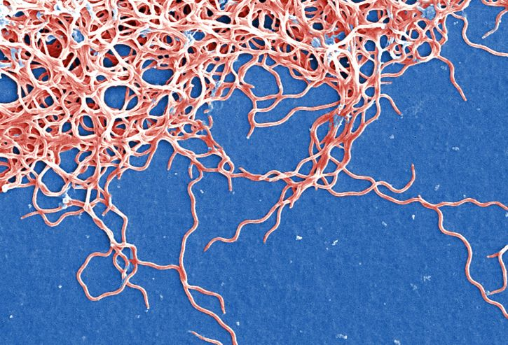

Assignment 3 

```{r}
Sequence<-read.csv("Sequences.csv")
X<-Sequence$x #the column x has the sequences
x<-X[[1]] #x = the first sequence
gregexpr("A",x) #use gregexpr function to find A's in the first sequence (x).It gives where it finds "A"
#22*7=154 A's
#I couldn't figure out how to count the number of matches so I counted manually 
gregexpr("T",x)
#114 T's
gregexpr("C",x)
#82 C's
gregexpr("G",x)
#131 G's

y<-X[2] #y=second sequence
gregexpr("A",y)
#155 A's
gregexpr("T",y)
#114 T's
gregexpr("G",y)
#132 G's
gregexpr("C",y)
#81 C's

z<-X[3] #z=third sequence 
gregexpr("A",z)
#154 A's
gregexpr("T",z)
#115 T's
gregexpr("G",z)
#131 G's
gregexpr("C",z)
#81 C's
```

#Sequence Analysis
```{r include=FALSE}
#running the code to access the sequence but not showing the output 
print(x)
print(y)
print(z)
#copying the sequences
#the sequences are pasted in the page below
```


##Sequences
* HQ433692.1 : 
AGCATGCAAGTCAAACGAGATGTAGCAATACATCTAGTGGCGAACGGGTGAGTAACGCGTGGATGATCTACCTATGAGATGGGGATAACTATTAGAAATAGTAGCTAATACCGAATAAGGTCAATTAATTTGTTAATTGATGAAAGGAAGCCTTTAAAGCTTCGCTTGTAGATGAGTCTGCGTCTTATTAGTTAGTTGGTAGGGTAAATGCCTACCAAGGCGATGATAAGTAACCGGCCTGAGAGGGTGAACGGTCACACTGGAACTGAGACACGGTCCAGACTCCTACGGGAGGCAGCAGCTAAGAATCTTCCGCAATGGGCGAAAGCCTGACGGAGCGACACTGCGTGAATGAAGAAGGTCGAAAGATTGTAAAATTCTTTTATAAATGAGGAATAAGCTTTGTAGGAAATGACGAAGTGATGACGTTAATTTATGAATAAGCCCCGGCTAATTACGTGCCAGCAGCCGCGGTAATACG

* HQ433694.1:
AGCATGCAAGTCAAACGGGATGTAGCAATACATTCAGTGGCGAACGGGTGAGTAACGCGTGGATGATCTACCTATGAGATGGGGATAACTATTAGAAATAGTAGCTAATACCGAATAAGGTCAGTTAATTTGTTAATTGATGAAAGGAAGCCTTTAAAGCTTCGCTTGTAGATGAGTCTGCGTCTTATTAGCTAGTTGGTAGGGTAAATGCCTACCAAGGCAATGATAAGTAACCGGCCTGAGAGGGTGAACGGTCACACTGGAACTGAGATACGGTCCAGACTCCTACGGGAGGCAGCAGCTAAGAATCTTCCGCAATGGGCGAAAGCCTGACGGAGCGACACTGCGTGAATGAAGAAGGTCGAAAGATTGTAAAATTCTTTTATAAATGAGGAATAAGCTTTGTAGGAAATGACAAAGTGATGACGTTAATTTATGAATAAGCCCCGGCTAATTACGTGCCAGCAGCAGCGGTAATACG

* HQ433691.1:
AGCATGCAAGTCAAACGAGATGTAGTAATACATCTAGTGGCGAACGGGTGAGTAACGCGTGGATGATCTACCTATGAGATGGGGATAACTATTAGAAATAGTAGCTAATACCGAATAAGGTCAATTAATTTGTTAATTGATGAAAGGAAGCCTTTAAAGCTTCGCTTGTAGATGAGTCTGCGTCTTATTAGTTAGTTGGTAGGGTAAATGCCTACCAAGGCGATGATAAGTAACCGGCCTGAGAGGGTGAACGGTCACACTGGAACTGAGACACGGTCCAGACTCCTACGGGAGGCAGCAGCTAAGAATCTTCCGCAATGGGCGAAAGCCTGACGGAGCGACACTGCGTGAATGAAGAAGGTCGAAAGATTGTAAAATTCTTTTATAAATGAGGAATAAGCTTTGTAGGAAATGACGAAGTGATGACGTTAATTTATGAATAAGCCCCGGCTAATTACGTGCCAGCAGCCGCGGTAATACG


Number of nucleotides
---------------------
Nucleotide|HQ433692.1|HQ433694.1|HQ433691.1
-|-|-|-
A|154|155|154
T|114|114|115
G|131|132|131
C|82|81|81

--making a table of number of nucleotides each sequence contains 

 

##*Borrelia burgdorferi*




[About *Borrelia burgdorferi*](https://en.wikipedia.org/wiki/Borrelia_burgdorferi)


--adding a picture of Borrelia burgdorferi and a link to wikipedia about it. the * around the name italicizes it. 


```{r eval=FALSE, include=FALSE}
GC_x=((131+82)/(131+82+154+114))*100
GC_y=((131+81)/(131+81+155+114))*100
GC_z=((131+81)/(131+81+154+115))*100
#calculating the GC content of each sequence
#not showing anything on the knitted page so that only the table can be seen 
x=44.283%
y=44.075%
z=44.075%
```

GC content in each sequence
-----------
Sequence ID|GC Content
-|-
HQ433692.1|44.283%
HQ433694.1|44.075%
HQ433691.1|44.075%

--making a table of GC content in each sequence

## %GC content of 1000 specimen
```{r echo=FALSE}
content<-read.csv("GC_content.csv")
content$GC<-content$G+content$C
#calculating %GC content and making a new column for it 

library(ggplot2)

plot<-ggplot(content,aes(x=ID,y=GC))+ #plot where xaxis=individual species and y= GC content
  geom_point(aes(colour=Species))+ #the points are discriminated by the colours according to the species, use of geom_point for making a scatter plot
  xlab("Individual specimen")+ #giving the x axis a title
  ylab("GC content(%)") #giving the y axis a title 

plot+theme_classic()+ #changing the theme of the plot to classic
  theme(axis.text.x=element_blank()) #getting rid of the names of the species on the x-axis

#only showing the graph in the knit page
```

Figure 1. The content of G and C nucleotide in percentage in genetic sequence of 1000 individaul specimen. Species A,B and C are distinguished by the colours of the points.

